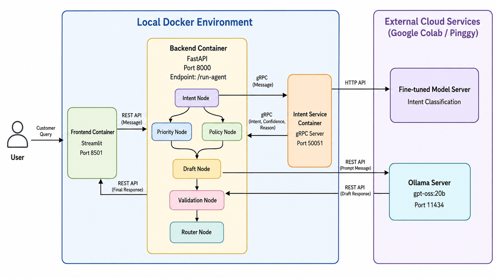

# Banking AI Agent — Microservice Architecture

> **Course:** Applications of Natural Language Processing in Industry (CSC15012)  
> **Instructor:** Dr. Nguyen Hong Buu Long & Dr. Le Duc Khoan

## Overview

A microservice-based AI Agentic Workflow for banking customer support. The system receives a customer message, routes it through a 6-node pipeline across multiple services, and returns either a direct reply, a request for more information, or an escalation to a human agent.

This project is an upgrade from the monolithic [banking-agentic](https://github.com/tunah72/banking-agentic) prototype into a multi-service deployment architecture using **gRPC**, **Docker**, and **Docker Compose**.

## Architecture



<!-- ```
                                    Docker Compose
┌──────────────────────────────────────────────────────────────────┐
│                                                                  │
│  ┌─────────────┐    HTTP     ┌──────────────┐    gRPC     ┌────────────────┐
│  │  Frontend   │ ──────────→ │ API Gateway  │ ──────────→ │ Intent Service │
│  │  (Streamlit)│             │  (FastAPI)   │             │  (gRPC Server) │
│  │  :8501      │             │  :8000       │             │  :50051        │
│  └─────────────┘             └──────┬───────┘             └───────┬────────┘
│     public_net                      │  internal_net               │
│                                     │                             │
└─────────────────────────────────────┼─────────────────────────────┘
                                      │ HTTP                   │ HTTP
                                      ▼                        ▼
                              ┌───────────────┐      ┌──────────────────┐
                              │ Ollama Service│      │ Fine-tuned Model │
                              │ (gpt-oss:20b) │      │ (Colab + Pinggy) │
                              └───────────────┘      └──────────────────┘
``` -->

### Services

| Service | Role | Port | Communication |
|---------|------|------|---------------|
| **API Gateway** (backend) | Receives HTTP requests, orchestrates the full workflow | 8000 | HTTP (in), gRPC (to intent), HTTP (to Ollama) |
| **Intent Service** | Predicts customer intent via fine-tuned model | 50051 | gRPC (in), HTTP (to fine-tuned model) |
| **Frontend** | Streamlit chat UI | 8501 | HTTP (to API Gateway) |

### Docker Networks

| Network | Services | Purpose |
|---------|----------|---------|
| `banking_public_net` | frontend, backend | External-facing communication |
| `banking_internal_net` | backend, intent-service | Internal gRPC communication |

## Workflow

```
Customer Message
    → [1] Intent Detection      fine-tuned Llama-3.1-8B via gRPC (BANKING77, 77 intents)
    → [2] Priority Detection    rules-based: low / medium / high
    → [3] Policy Retrieval      lookup from policies.py (77 banking policies)
    → [4] Response Drafting     gpt-oss:20b via Ollama (streaming)
    → [5] Validation            heuristic quality checks
    → [6] Router                reply / ask_more / escalate
```

## Tech Stack

| Component | Technology |
|-----------|------------|
| API Gateway | FastAPI + Python |
| Frontend | Streamlit |
| Intent Detection | Fine-tuned Llama-3.1-8B QLoRA (`tunah/banking-intent`) via gRPC |
| Response Generation | gpt-oss:20b via Ollama (streaming) |
| Inter-service Communication | gRPC (protobuf) |
| LLM Hosting | Google Colab (T4 GPU) + Pinggy port forwarding |
| Containerization | Docker + Docker Compose |

## Setup

### 1. Clone the repository

```bash
git clone https://github.com/tunah72/banking-service.git
cd banking-service
```

### 2. Configure environment

```bash
cp .env.example .env
```

Edit `.env` with the Pinggy URLs from your Colab sessions:

```env
OLLAMA_URL=http://your-ollama-pinggy-url.a.free.pinggy.link
OLLAMA_MODEL=gpt-oss:20b
INTENT_API_URL=http://your-intent-pinggy-url.a.free.pinggy.link
```

### 3. Start Colab sessions

**Session 1 — Ollama (gpt-oss:20b):**  
Run `notebooks/Ollama-Pinggy.ipynb` on Colab with T4 GPU. Copy the Pinggy URL → `OLLAMA_URL`.

**Session 2 — Intent Inference Server:**  
Run `notebooks/intent_server.ipynb` on Colab with T4 GPU. Copy the Pinggy URL → `INTENT_API_URL`.

### 4. Generate gRPC code (optional — Docker build does this automatically)

```bash
cd intent_service
pip install grpcio-tools
make
```

This generates `intent_service_pb2.py` and `intent_service_pb2_grpc.py` from `intent_service.proto`.

### 5. Build & Run with Docker Compose

```bash
docker compose up --build
```

Services:
- **API Gateway:** `http://localhost:8000`
- **Frontend UI:** `http://localhost:8501`
- **Intent Service (gRPC):** `localhost:50051`

### 6. Stop

```bash
docker compose down
```

## API Usage

### GET /health

```bash
curl http://localhost:8000/health
```

### GET /config

```bash
curl http://localhost:8000/config
```

### POST /run-agent

```bash
curl -X POST http://localhost:8000/run-agent \
  -H "Content-Type: application/json" \
  -d '{"message": "My card was stolen, I need to block it immediately."}'
```

**Response:**
```json
{
  "message": "Thank you for contacting us. Your request has been escalated...",
  "action": "escalate",
  "trace": {
    "intent": {"intent": "lost_or_stolen_card", "confidence": 0.97, "reason": "..."},
    "priority": {"level": "high", "reason": "...", "matched_keywords": ["stolen"]},
    "policy": {"intent": "lost_or_stolen_card", "policy_text": "...", "guidelines": [...]},
    "draft": {"draft_reply": "...", "missing_info": [], "next_action": "block_card"},
    "validation": {"is_valid": true, "issues": [], "should_escalate": true},
    "routing": {"action": "escalate", "final_response": "...", "reason": "..."}
  }
}
```

### POST /chat/stream

Streaming version — returns SSE events:

```
data: {"type": "chunk", "text": "Thank"}
data: {"type": "chunk", "text": " you"}
...
data: {"type": "done", "action": "escalate", "trace": {...}}
```

## Project Structure

```
banking-service/
├── backend/                          # API Gateway (FastAPI)
│   ├── app/
│   │   ├── agent/
│   │   │   └── orchestrator.py       # Workflow controller (normal + stream)
│   │   ├── clients/
│   │   │   ├── base.py               # Abstract LLM client
│   │   │   ├── grpc_intent_client.py  # gRPC client for intent service
│   │   │   ├── intent_grpc/           # Generated protobuf stubs
│   │   │   │   ├── intent_service_pb2.py
│   │   │   │   └── intent_service_pb2_grpc.py
│   │   │   └── ollama_client.py       # Ollama HTTP client
│   │   ├── core/
│   │   │   ├── schemas.py             # Pydantic models
│   │   │   └── settings.py            # Config (reads env vars)
│   │   ├── data/
│   │   │   └── policies.py            # 77 banking policies
│   │   ├── main.py                    # FastAPI app (/run-agent, /health, /config)
│   │   └── nodes/                     # 6 pipeline nodes
│   ├── run.py                         # Entry point
│   ├── requirements.txt
│   └── Dockerfile
│
├── intent_service/                    # Intent Detection (gRPC microservice)
│   ├── app/
│   │   ├── clients/
│   │   │   └── intent_client.py       # HTTP client → fine-tuned model (Colab)
│   │   ├── core/
│   │   │   ├── schemas.py
│   │   │   └── settings.py
│   │   └── nodes/
│   │       └── intent_node.py         # Intent prediction logic
│   ├── client.py                      # gRPC test client
│   ├── intent_service.proto           # Protobuf definition
│   ├── Makefile                       # Generate gRPC stubs
│   ├── server.py                      # gRPC server entry point
│   ├── requirements.txt
│   └── Dockerfile
│
├── frontend/                          # Chat UI (Streamlit)
│   ├── app.py
│   ├── requirements.txt
│   └── Dockerfile
│
├── docker-compose.yml                 # 3 services + 2 networks
├── .env.example
└── .gitignore
```

## Container Roles

| Container | Description |
|-----------|-------------|
| `banking-backend` | API Gateway — receives customer messages, calls Intent Service via gRPC, executes workflow nodes, calls Ollama for response generation, returns structured output |
| `intent-service` | Intent Detection — receives gRPC requests, calls the fine-tuned model (on Colab), returns predicted intent with confidence |
| `banking-frontend` | Chat Interface — Streamlit UI for customer interaction, streams responses from API Gateway |

## Demo Video

Link [here](https://drive.google.com/drive/folders/1DAx66sPsXCC8s-kwh48MhhFAqh-UTvos?usp=sharing)
